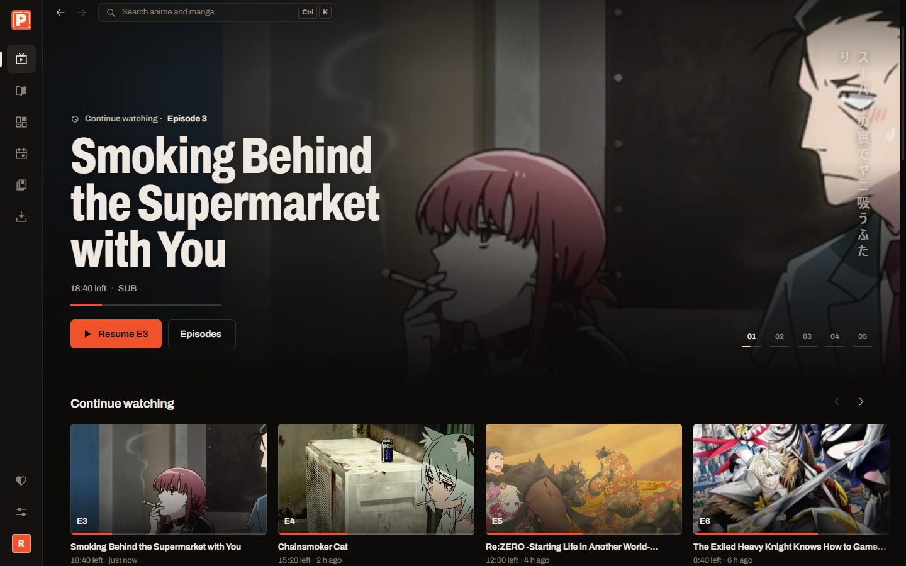
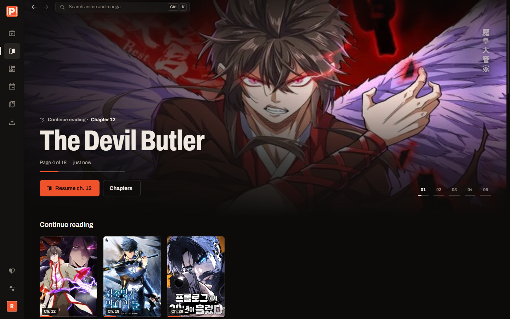
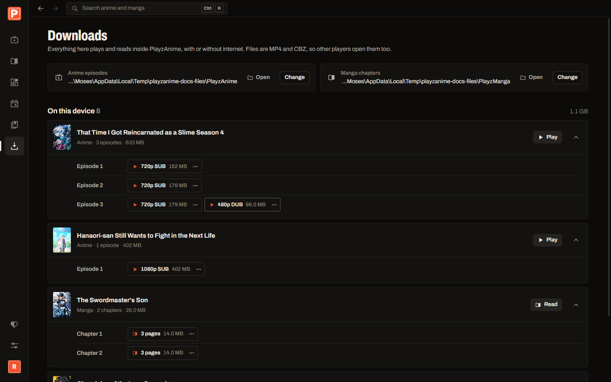
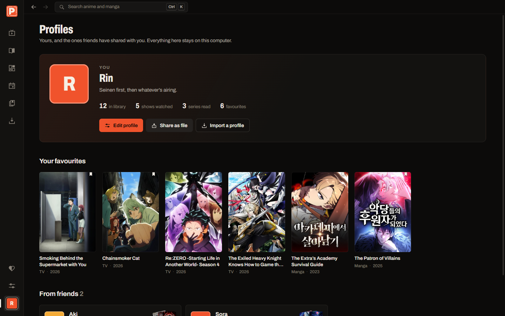
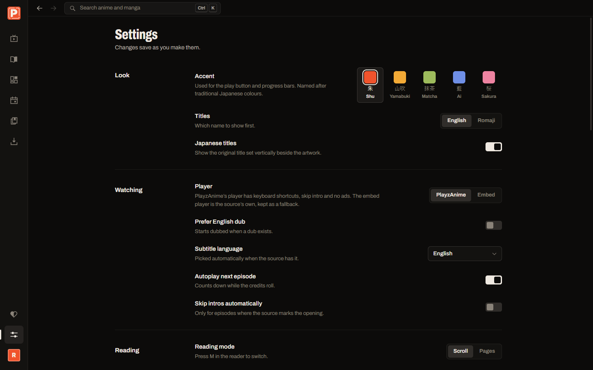

<p align="center">
<a href="https://playz-anime.onrender.com/">

</a>
</p>

<h1 align="center"><b>PlayzAnime</b></h1>

<p align="center">

</p>

<p align="center">
  <a href="https://playzae.github.io/playz_anime_landingpage/">Website</a> |
  <a href="https://playz-anime.onrender.com">Watch Online (Web App)</a> |
  <a href="https://playzae.github.io/playz_anime_landingpage/docs">Documentation</a> |
  <a href="https://playzae.github.io/playz_anime_landingpage/docs/policies/dmca">Copyright</a>
</p>

<div align="center">
  <a href="https://github.com/PlayzAe/playz_anime_desktopapp">
    
  </a>
  <a href="https://playz-anime.onrender.com">
    
  </a>
  <a href="https://github.com/PlayzAe/playz_anime">
    
  </a>
  <a href="https://github.com/PlayzAe/playz_anime/blob/main/docs/LEGAL.md">
    
  </a>
</div>

<h5 align="center">
Leave a star if you like the project.
</h5>

<br>

## About

PlayzAnime is a **streaming platform** and **media client** with a **web app** and **desktop edition** for streaming anime, reading manga, and managing your AniList library with custom players and zero ads.

> [!IMPORTANT]
> PlayzAnime does not host, upload, or store any video files on its servers. All streams, episodes, and manga chapters are scraped from third-party services and public APIs. Users are responsible for complying with their local copyright laws.

> [!NOTE]
> **Mobile & Android Display Notice:**
> The web streaming platform is designed for **laptops, TVs, and desktop monitors**. Android and phone browser viewing is currently unoptimized and may appear scattered. A dedicated native **Android app is coming soon**!

---

## Screenshots

<p align="center"></p>

<table>
  <tr>
    <td width="50%"><br/><sub>Manga, manhwa and manhua from many sources</sub></td>
    <td width="50%"><br/><sub>Downloads: episodes as MP4, chapters as CBZ</sub></td>
  </tr>
  <tr>
    <td width="50%"><br/><sub>Profiles you can share with friends</sub></td>
    <td width="50%"><br/><sub>Settings, with five accent colours</sub></td>
  </tr>
</table>

## Features

- **Native Custom Player:** Powered by `hls.js` with adaptive bitrate streaming (1080p, 720p, 480p, 360p), full keyboard shortcuts, smooth volume controls, and picture-in-picture.
- **In-Player Subtitle Customizer:** Real-time subtitle styling directly in the player. Customize font size (small to huge), colors (classic white, anime yellow, cyan, emerald), background styles (box, drop-shadow, outline), font families, and vertical position.
- **Auto Skip Intro & Outro:** Automatically identifies episode intro/outro marks and skips them seamlessly.
- **Dual-Audio Support & Download Subtitles:** Instant toggle between Sub (Japanese audio with subtitles) and Dub (English audio). When downloading, choose any subtitle track to embed into the MP4—even with English Dub.
- **55+ Multi-Source Manga & Manhwa Engine:** Tachiyomi/Mihon-inspired architecture featuring 55+ scanlation teams and aggregators (Asura Scans, Reaper Scans, Bato.to, MangaReader, MangaFreak, MangaSee, MangaDex, etc.) with smart chapter auto-picking and in-reader source switcher.
- **Zero-Captcha Anti-Bot & DDoS Shield:** Sliding-window rate limiter and instant exploit probe dropping to maintain zero latency and prevent bot crashes on low-tier hosting (e.g. Render Free Tier).
- **Auto-Update Notifier:** Checks official GitHub releases on boot (after animations finish) using zero API keys and alerts users to new features and downloads.
- **AniList Integration:** Real-time client-side catalog browsing, seasonal charts, trending releases, airing schedules, and search with zero server bottlenecks.
- **Embed Fallback:** Switch between the native player and third-party embed players on the fly with built-in ad and popup filtering.
- **Data Saver Mode:** Compresses manga pages for low-bandwidth connections.
- **Zero Tracking & Privacy:** Watch history, reading progress, and custom profile settings are stored 100% locally in your browser.
- **Docker & Cloud Ready:** Production multi-stage Docker setup ready to deploy to Render, Koyeb, or your own VPS.

---

## Get started

Launch the live web application directly in your browser:

<p align="center">
<a href="https://playz-anime.onrender.com" style="font-size:18px;">
<b>Open PlayzAnime Web App →</b>
</a>
</p>

<br>

## Tech stack

* **Frontend:** [React 19](https://react.dev/), [TypeScript](https://www.typescriptlang.org/), [Vite](https://vite.dev/), [Motion](https://motion.dev/)
* **Player Pipeline:** [hls.js](https://github.com/video-dev/hls.js/)
* **Backend Server:** [Node.js](https://nodejs.org/), [esbuild](https://esbuild.github.io/)
* **Desktop Client:** [Electron](https://www.electronjs.org/)

---

## Development and Build

Building from source is straightforward. You will need [Node.js](https://nodejs.org/) (>= 20) and npm installed on your system.

### 1. Install dependencies
```bash
npm install
npm install --prefix server
```

### 2. Start development mode
```bash
# Windows convenience script (launches frontend on :5311 and server on :5310)
start.bat
```
Or start each service manually:
```bash
# Terminal 1: Backend Server
npm --prefix server run dev

# Terminal 2: Frontend
npm run dev
```

### 3. Production Build
```bash
npm run build
npm --prefix server run build
npm --prefix server start
```

---

This repository includes a multi-stage [Dockerfile](Dockerfile) ready for one-click deployment. See [docs/DEPLOY.md](docs/DEPLOY.md) for full instructions.

1. Connect this repo to **[Render](https://render.com)** as a **Web Service**.
2. Set Runtime to **Docker** and Instance Type to **Free**.
3. Configure the following Environment Variables:
   - `HOST` = `0.0.0.0`
   - `PLAYZANIME_RELAY` = `on`
   - `PROXY_SECRET` = `<random_string>`
   - `ALLOWED_ORIGINS` = `https://playzae.github.io`
4. Click **Deploy Web Service**. Render serves both the frontend and streaming backend from one URL.

<br>

> [!IMPORTANT]
> The public web streaming instance has a high tendency to go down, face upstream blocks, or get taken down quickly. Domain changes for both the streaming website and landing page are coming soon.
> 
> To guarantee continuous, uninterrupted access:
> - **Bookmark the landing page and GitHub:** Keep [playzae.github.io/playz_anime_landingpage](https://playzae.github.io/playz_anime_landingpage/) bookmarked for active mirrors and domain announcements.
> - **Download the Windows Desktop App:** The desktop app runs locally, streams directly, supports true offline downloads, and will never go down. Check [PlayzAe/playz_anime_desktopapp](https://github.com/PlayzAe/playz_anime_desktopapp) for the latest release.
> 
> For copyright requests and DMCA notices, refer to [playzae.github.io/playz_anime_landingpage/docs/policies/copyright-and-dmca](https://playzae.github.io/playz_anime_landingpage/docs/policies/copyright-and-dmca).
