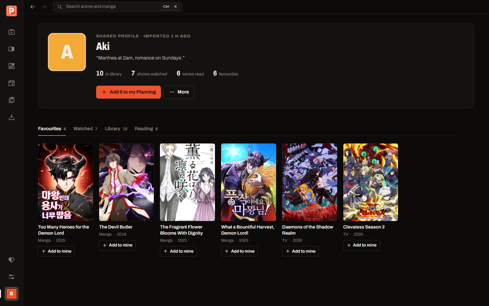
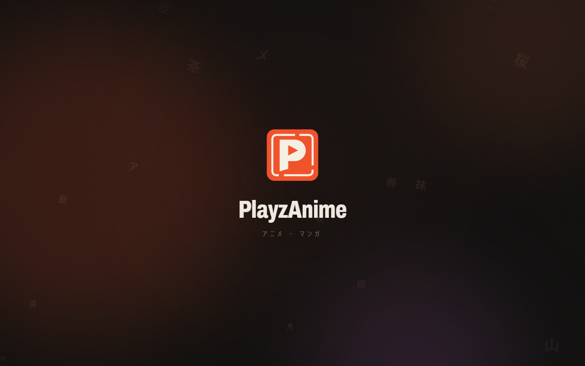
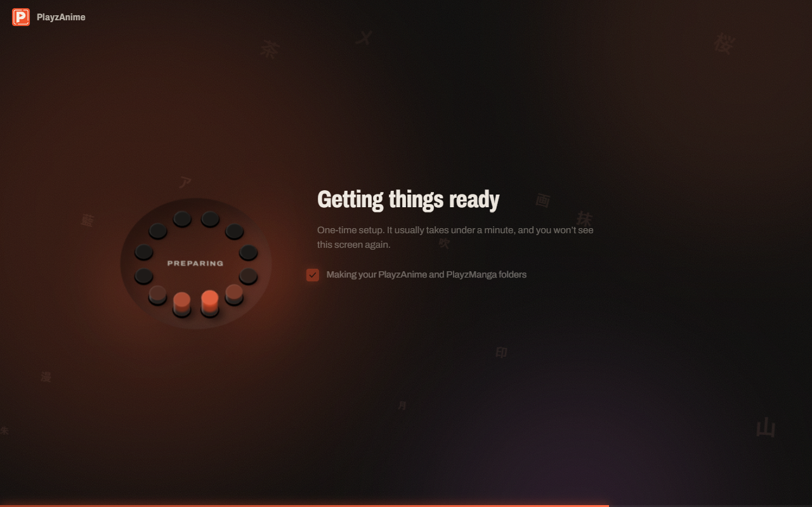

<p align="center">
  
</p>

<h1 align="center"><b>PlayzAnime</b></h1>

<p align="center">
  
</p>

<p align="center">
  <a href="#get-started">Get started</a> ·
  <a href="#features">Features</a> ·
  <a href="docs/EDGE_CASES.md">Edge cases</a> ·
  <a href="#development">Development</a>
</p>

<div align="center">
  
  
  
  
  <a href="https://github.com/PlayzAe"></a>
</div>

<h5 align="center">If PlayzAnime is useful to you, a star or a follow on <a href="https://github.com/PlayzAe">GitHub</a> keeps it going.</h5>

## About

PlayzAnime is a Windows desktop app for **watching and downloading anime** and **reading and downloading manga, manhwa and manhua**, in one place. Metadata comes from AniList; streams and chapters come from public third-party sources. It has its own player, its own reader, an offline library, and a small, private profile you can share with friends as a file.

> [!IMPORTANT]
> PlayzAnime does not host, upload or distribute any media. It links to content that third-party sites already make public. You're responsible for how you use it and for following the laws where you live.

## Features

- **Its own player.** Streams play in PlayzAnime's player with no ads: skip intro, up next, subtitles in any script, keyboard shortcuts, picture-in-picture, taskbar play/pause/next buttons and Windows media keys.
- **Downloads that survive anything.** Episodes save as MP4 with subtitles inside, and chapters save as CBZ. Downloads resume where they stopped, wait out rate limits, and go into tidy folders: `PlayzAnime\<Show>\Season 2\<Show>_E05_720p.mp4` and `PlayzManga\<Series>\<Series>_Ch012.cbz`.
- **Offline mode.** With no internet, PlayzAnime opens on your downloads. Episodes play and chapters read inside the app, grouped by series, then episode, then quality.
- **Four chapter sources, picked for you.** MangaDex, WeebCentral, Flame Comics and MangaPill are checked in parallel. The app reads from whichever is furthest along and skips any that are down. There's a live health check in Settings.
- **A reader built for both formats.** Manga opens in pages, right to left. Manhwa and manhua open as one long strip. There's fit width or fit height, keyboard paging, and "read this chapter from another source" when one fails.
- **Profiles.** Pick a name, a picture and your favourites. Share your profile as a `.playzanime` file; a friend drops it onto their app, or double-clicks it, and sees what you've watched, saved and are reading, in its own tab, without touching their own lists.
- **One-time setup.** The first launch creates your folders, checks Windows folder protection (and offers to fix it), and warms the catalogue, all with an animated setup in your accent colour.
- **Made for slow connections.** Data saver keeps buffers small, caps quality at 720p and uses compressed pages. Artwork is cached on disk for a month, so revisiting a page costs nothing.
- **Three ways to ship.** Run from source with `start.bat`, a portable single exe that keeps its data beside it, or an installer with shortcuts and an uninstaller.

<table>
  <tr>
    <td></td>
    <td></td>
  </tr>
  <tr>
    <td></td>
    <td></td>
  </tr>
  <tr>
    <td></td>
    <td></td>
  </tr>
</table>

## Get started

1. Download `PlayzAnime-Setup-<version>.exe` (installer) or `PlayzAnime-Portable-<version>.exe` (no install).
2. Windows SmartScreen may warn about an unsigned app: choose **More info → Run anyway**.
3. The first launch sets everything up. It takes under a minute.

**Downloads fail with Controlled folder access on?** Windows Defender's ransomware protection blocks unknown apps from writing to Desktop, Documents and Videos. Choose **Allow PlayzAnime** during setup or in **Settings → Downloads**, or run `resources\tools\allow-folder-access.bat` from the install folder. For the portable exe, drag the exe onto that `.bat`. Until then, downloads go to your Downloads folder, which Windows leaves open.

## Keyboard

| Keys | Action |
|---|---|
| `Ctrl K` or `/` | Search anime and manga |
| `Space` / `K` | Play or pause |
| `J` / `L`, `←` / `→` | Back or forward 10 s / 5 s |
| `N` / `P` | Next or previous episode |
| `S` | Skip intro |
| `C` | Cycle subtitles |
| `F`, `T` | Full screen, theater mode |
| `[` / `]` | Previous or next chapter |
| `M` | Scroll or page mode in the reader |

## Development

| What | How | Output |
|---|---|---|
| Local testing | double-click `start.bat` (or `start.bat setup` to see first-run setup again) | dev mode with hot reload |
| Production build from source | `start.bat built` | builds `out/` and runs it like the real app |
| Portable exe and installer | double-click `build.bat` | `release/PlayzAnime-Setup-<v>.exe`, `release/PlayzAnime-Portable-<v>.exe` |

You need Node.js LTS to build. The people you send the installer to need nothing.

```bash
npm run dev                      # same as start.bat
npm run typecheck
npm run selftest                 # offline: HLS → MP4, resume, 429 back-off, offline playback, CBZ reading, profile import
npm run probe -- manga shelf     # which source serves each title on the Manhwa shelf
npm run probe -- manga 105398    # one title: AniList → every source → pages
npm run probe -- anime 154587    # AniList → episodes → stream
npm run docs:shots               # regenerate these screenshots from a demo profile (no streaming)
```

```
src/
  main/          Electron main process
    sources/       anikoto (episodes), mangadex, weebcentral, flame, mangapill (chapters)
    manga.ts       source registry: health checks, matching, auto-pick
    episodes.ts    AniList → episode list (MAL id match), Kitsu stills where AniList has none
    extractor.ts   episode embed → HLS stream, in a hidden window
    downloader.ts  resumable queue: HLS → MP4, pages → CBZ
    offline.ts     pzmedia:// — downloaded videos (with seeking) and CBZ pages for the app
    profiles.ts    .playzanime files: export, strict import checks, open-with
    windowsGuard.ts  Controlled folder access detection and allow-listing
    store.ts       settings, lists, history, profiles in one JSON file
  preload/       the typed bridge (window.playzanime)
  renderer/      React UI (views, player, reader, components)
  shared/        types used on both sides
tools/           allow-folder-access.ps1 / .bat (shipped in resources\tools)
docs/            screenshots, EDGE_CASES.md
```

## Notes

- **Size.** The installer is about 100 MB. ffmpeg (80 MB) isn't bundled: it's fetched and checksum-verified the first time you download an episode.
- **Sources change.** When a site changes its pages, `npm run probe` shows which step broke.
- **Inspiration.** The feature set takes cues from [Seanime](https://github.com/5rahim/seanime); PlayzAnime's design and code are its own. Its [issue tracker](https://github.com/5rahim/seanime/issues) shaped the [edge cases](docs/EDGE_CASES.md) handled here.

